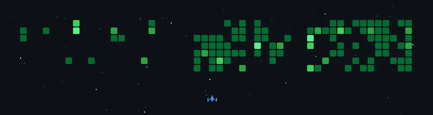

---

## Tech Stack

### Backend

  
  
  
  
  
  
  

### AI

  
  
  
  
  
  
  
  
  

### Cloud / Infra

  
  
  
  
  
  
  
  
  

### Embedded

  
  
  
  
  
  

### Collaboration

  
  
  
  
  
  

---

## Activities

  
| 활동 | 내용 | 연도 |
|:---:|:---:|:---:|
| 코리아 IT 아카데미 JSP & Spring Boot 백엔드 과정 | Backend Developer | 2023.01 ~ 2023.06 |
| FARM SYSTEM 4기 웹/보안 트랙 | Backend Developer | 2025.03 ~ 2025.12 |
| AWS Cloud Club at DGU 1기 | General Member | 2025.07 ~ 2026.04 |
| Computer Security & Distributed Computing LAB | 학부연구생 | 2025.07 ~ |
| Computer Architecture Lecture | 조교(Teaching Assistant) | 2026.03 ~ 2026.06 |
| AWS Student Builder Groups at DGU 1기 | Core Member(운영진) | 2026.05 ~ |
| SKT FLY AI CHALLENGER 9기 | AI & Cloud Developer | 2026.06 ~ 2026.09 |
| IOT Microprocessor Lecture | 조교(Teaching Assistant) | 2026.09 ~ |

  
  

---

## Awards

  
| 연도 | 대회 | 수상 | 레포 |
|:---:|:---:|:---:|:---:|
| 2026.09 | SKT FLY AI CHALLENGER 9기 개인 최우수상 | SK텔레콤 대표이사상 | https://github.com/sktflyai9th5 |
| 2026.09 | SKT FLY AI CHALLENGER 9기 프로젝트 부문 | SK텔레콤 대표이사상 | https://github.com/sktflyai9th5 |
| 2025.12 | 제15회 피우다 프로젝트 공모전 | 정보통신산업진흥원장상 | https://github.com/koreamax/piudaback |
| 2025.08 | 2025 K-HTML 해커톤 | 동대문구청장상 | https://github.com/koreamax/walk_web |

---

## Qualifications

| 연도 | 자격증 | 관리협회 |
|:---:|:---:|:---:|
 2026.08 | Microsoft Azure AI Fundamentals | Microsoft Learn |
| 2026.08 | AWS Certified Cloud Practitioner | AWS Training and Certification |
| 2025.04 | 네트워크관리사 2급 | 한국정보통신자격협회 |
| 2023.02 | COSPRO (C) 2급 | YBM IT |

---

## Projects

### 🟢 In Progress

| 프로젝트 | 소개 | 분야 | 상태 |
|:--|:--|:--:|:--:|
| [Goliath Crane](https://github.com/koreamax/Hanhwa-Ocean-Goliath-Crane) | 🏗️ 한화오션 골리앗 크레인용 LiDAR 기반 ROS2 상황 인식 시스템 |  | 🟢 진행 중 |
| [GSV Paper](https://github.com/koreamax/GSV_SIGNBOARD) | 🪧 구글 스트리트뷰 간판을 YOLO로 검출하고 OCR + VLM으로 텍스트를 추출하는 파이프라인 |  | 🟢 진행 중 |
| [JeokjaeJeokso](https://github.com/koreamax/2026ESWContest_mobility_JeokjaeJeokso) | 🚛 현대자동차 임베디드 SW 공모전 라즈베리파이 센서로 트럭 적재물을 측정하고 디지털 트윈으로 시각화 |  | 🟢 진행 중 |

### 🔴 Completed

| 프로젝트 | 소개 | 분야 | 상태 |
|:--|:--|:--:|:--:|
| [VIAssist](https://github.com/koreamax/VIAssist_Total) | 🦯 한이음 프로젝트 Jetson Orin Nano 기반 YOLO + Optical Flow + VLM + TTS 시각장애인 보행 보조 웨어러블 |   | 🔴 종료 |
| [beautytalk](https://github.com/koreamax/beautytalk-app) | 💄 시각장애인·저시력 사용자를 위한 메이크업 도우미 |    | 🔴 종료 |
| [LLM ROUTER](https://github.com/koreamax/SKTLLMROUTER0.710) | 🧭 SKT Efficient LLM Routing Challenge 질문에 맞는 모델로 라우팅해 비용과 품질을 동시에 잡는 라우터 |  | 🔴 종료 |
| [Mission Pawss!ble](https://github.com/koreamax/TECH4GOOD_OH) | 🐕 반려견 산책으로 도시 위험을 발견하고 지자체와 연결하는 시민참여 플랫폼 |    | 🔴 종료 |
| [Wilson](https://github.com/koreamax/wilson_chatbot) | 👴 치매 노인을 위한 말벗 챗봇 |    | 🔴 종료 |
| [Cloud Island](https://github.com/koreamax/cloud-island) | 🪐 AWS CloudTrail 로그를 3D 행성과 우주 탐험 인터페이스로 시각화 |   | 🔴 종료 |
| [Seagnal](https://github.com/koreamax/piudaback) | 🌊 해양 환경 정화 활동을 위한 통합 ICT 플랫폼 |   | 🔴 종료 |
| [WalkingCity](https://github.com/koreamax/walk_web) | 🚶 동대문구 주민 취향 맞춤 산책 경로 추천 서비스 |    | 🔴 종료 |

---

## Study

| 제목 | 링크 |
|:---:|:---:|
| 클라우드 블로그 | https://velog.io/@koreamax01/series/%ED%81%B4%EB%9D%BC%EC%9A%B0%EB%93%9C |
| Docker 블로그 | https://velog.io/@koreamax01/series/Docker |
| Socket & Network Programming 정리 | https://github.com/koreamax/network-programming |
| Operating System & Computer Architecture 스터디 | https://github.com/koreamax/OS_Study |
| Kubernetes(K8S) 스터디 | https://github.com/koreamax/asbg-1st-devops-study-2 |

---

## Certifications

| 연도 | 수료증 | 발급기관 |
|:---:|:---:|:---:|
| 2026.07 | SK suniC 5기 하프 코스 이수증 | SK suniC |
| 2025.10 | Google Cloud Fundamentals: Core Infrastructure | 아이코어이앤씨(iCORE) |
| 2025.08 | Ascent: Snowflake Platform Training - APAC | Snowflake University |

---

## GitHub Stats

---

## Algorithm

 **백준 허브** : [koreamax/Coding_test_Algorithm](https://github.com/koreamax/Coding_test_Algorithm)

---

